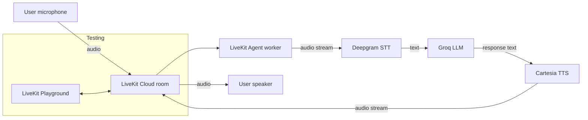

# Voice AI Agent

A real-time, voice-to-voice conversational AI agent built with **LiveKit Agents**, using
**Groq** for language understanding/generation, **Deepgram** for speech-to-text, and
**Cartesia** for text-to-speech. Tested via the **LiveKit Playground**.

## 1. Overview

This agent joins a LiveKit room, listens to a user over audio, transcribes their speech,
generates a spoken-style reply with an LLM, and speaks the reply back — a full duplex
voice conversation loop with automatic turn-taking and interruption handling, all
provided by the LiveKit Agents framework.

## 2. Architecture



## 3. Technology stack

| Layer            | Provider              | Package                          |
|-------------------|------------------------|-----------------------------------|
| Realtime transport | LiveKit Cloud          | `livekit-agents`                  |
| Agent framework    | LiveKit Agents (v1.x)  | `livekit-agents`                  |
| STT (speech→text)  | Deepgram (`nova-3`)    | `livekit-plugins-deepgram`        |
| LLM (reasoning)     | Groq (`llama-3.3-70b-versatile`) | `livekit-plugins-groq`     |
| TTS (text→speech)  | Cartesia (`sonic-3`)   | `livekit-plugins-cartesia`        |
| Turn-taking / VAD  | Silero VAD             | `livekit-plugins-silero`          |
| Testing UI         | LiveKit Playground      | (hosted, no install needed)       |

## 4. Voice flow

1. User speaks into their mic (via LiveKit Playground).
2. Audio streams into the LiveKit room the agent has joined.
3. Deepgram STT converts the audio into text in real time.
4. Groq LLM receives the transcript + conversation history and generates a reply.
5. Cartesia TTS converts the reply text into speech audio.
6. The audio streams back into the room; the user hears the agent speak.
7. Silero VAD handles turn-taking (knowing when the user has stopped speaking) and lets
   the user interrupt the agent mid-reply, same as a natural conversation.

## 5. Prerequisites

- Python 3.9+ (this project was built and verified with **Python 3.12**)
- Git
- Accounts + API keys for:
  - [LiveKit Cloud](https://cloud.livekit.io/) (free tier is enough)
  - [Groq](https://console.groq.com/keys)
  - [Deepgram](https://console.deepgram.com/)
  - [Cartesia](https://play.cartesia.ai/keys)

## 6. Required API keys / environment variables

Copy `.env.example` to `.env` and fill in your real values:

```
LIVEKIT_URL=wss://your-project-name.livekit.cloud
LIVEKIT_API_KEY=your_livekit_api_key
LIVEKIT_API_SECRET=your_livekit_api_secret
GROQ_API_KEY=your_groq_api_key
DEEPGRAM_API_KEY=your_deepgram_api_key
CARTESIA_API_KEY=your_cartesia_api_key
```

**Where to get the LiveKit values:** LiveKit Cloud dashboard → your project →
**Settings → Keys**. The URL, API Key and API Secret are all shown there.
**Never commit the real `.env` file** — it's already excluded in `.gitignore`.

## 7. Installation

```bash
# 1. Clone your repo (after you've pushed it) or use this folder directly
cd voice-ai-agent

# 2. Create and activate a virtual environment
python -m venv .venv
# Windows:
.venv\Scripts\activate
# macOS/Linux:
source .venv/bin/activate

# 3. Install dependencies
pip install -r requirements.txt

# 4. Download required model files (Silero VAD)
python -m livekit.agents download-files

# 5. Set up your credentials
cp .env.example .env
# now edit .env with your real API keys

# 6. Verify everything is configured correctly
python test_setup.py
```

`test_setup.py` checks that all env vars are present and that each API key is actually
valid (it makes a small real request to Groq, Deepgram, Cartesia, and locally signs a
LiveKit token). Fix anything it reports before moving on.

## 8. How to run the agent

**Quick terminal test (no LiveKit Cloud/Playground needed, talks through your local mic/speaker):**
```bash
python agent.py console
```
This is the fastest way to sanity-check the STT→LLM→TTS pipeline end to end.

**Run as a worker connected to LiveKit Cloud (needed for Playground testing):**
```bash
python agent.py dev
```
This starts the agent worker, connects it to your LiveKit Cloud project using the
credentials in `.env`, and leaves it waiting for a room to join. Keep this terminal
running.

(`python agent.py start` is the equivalent production/non-hot-reload mode.)

## 9. How to test using LiveKit Playground

1. Make sure `python agent.py dev` is running in a terminal (step 8).
2. Open the LiveKit Playground: **https://agents-playground.livekit.io/**
3. Sign in with the same LiveKit Cloud account, and select your project (the one
   matching `LIVEKIT_URL` in your `.env`).
4. Click **Connect** — the Playground automatically creates a room and generates a
   token for you; no manual token handling is needed for this testing flow.
5. Your running agent worker will automatically be dispatched into that room (you'll
   see it join in your `dev` terminal logs).
6. Allow microphone access when prompted, then speak.
7. You should see your live transcript appear, and hear the agent's spoken reply.

## 10. Testing checklist

- [ ] `python agent.py dev` starts with no errors and shows `registered worker`
- [ ] Agent appears connected in the Playground room
- [ ] Speaking produces a live transcript (Deepgram STT working)
- [ ] A relevant reply is generated (Groq LLM working)
- [ ] The reply is spoken back audibly (Cartesia TTS working)
- [ ] Interrupting the agent mid-sentence stops it and it listens again (VAD working)

## 11. Example conversation

```
You:    Hi, who are you?
Agent:  Hey there! I'm your voice assistant, ready to help with anything you need.
        What can I do for you today?

You:    What's 15 times 6?
Agent:  15 times 6 is 90.

You:    Tell me a fun fact about space.
Agent:  Sure! A day on Venus is longer than its year — it takes Venus about
        243 Earth days to rotate once, but only 225 Earth days to orbit the sun.
```

## 12. Troubleshooting

| Problem | Likely cause | Fix |
|---|---|---|
| `ImportError` on startup | Dependencies not installed / wrong venv active | Re-run `pip install -r requirements.txt` inside the activated venv |
| Agent worker won't connect to LiveKit | Wrong `LIVEKIT_URL`/key/secret, or firewall | Re-check `.env` values against LiveKit Cloud dashboard; run `python test_setup.py` |
| No transcript appears in Playground | Deepgram key invalid, or mic not allowed in browser | Check `DEEPGRAM_API_KEY`; check browser mic permission |
| Agent doesn't reply / errors in logs | Groq key invalid or model name wrong | Check `GROQ_API_KEY`; confirm the model string is still valid on Groq's model list |
| Transcript is correct but no audio plays | Cartesia key invalid, or browser audio blocked | Check `CARTESIA_API_KEY`; check browser tab isn't muted |
| Agent never joins the room in Playground | `python agent.py dev` isn't running, or pointed at a different project | Make sure the worker terminal is running and its `.env` project matches the Playground project |
| `download-files` fails for turn-detector | Not used in this project — this agent relies on Silero VAD for turn-taking, not the separate turn-detector model, so this is expected/skippable |

**What happens if a component fails, in the running agent itself:**
- **STT fails/disconnects:** LiveKit Agents will surface an error in the session; the
  agent won't receive a transcript for that turn, so it stays silent until the user
  speaks again or the connection recovers.
- **LLM fails:** the agent has no reply text to speak, so no audio is generated for
  that turn — the error is logged in the worker terminal.
- **TTS fails:** the agent has the reply text but can't voice it — again logged, no
  audio played.
- In production you'd add retries/fallback providers for each stage; see below.

## 13. Future improvements

- Add a fallback LLM/STT/TTS provider for resilience if the primary provider errors
- Add function-calling tools (e.g. look up real data, take actions) via LiveKit Agents' tool-calling support
- Deploy the worker to LiveKit Cloud's managed Agents hosting (or a container/VM) so it runs 24/7 instead of `dev` mode on a laptop
- Add call recording / conversation logging and analytics
- Add multilingual support (Deepgram + Cartesia both support multiple languages)
- Add a custom frontend instead of relying on the generic Playground UI
